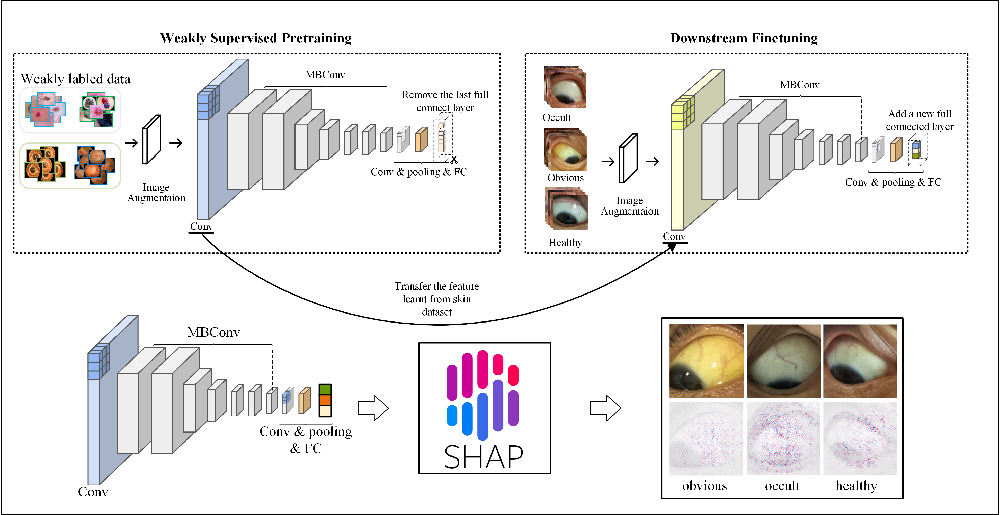

<!--
 * @Author       : Yuanting Ma
 * @Github       : https://github.com/YuantingMaSC
 * @LastEditors  : Yuanting_Ma 
 * @Date         : 2024-12-06 09:16:50
 * @LastEditTime : 2025-02-10 16:21:33
 * @FilePath     : /JaunENet/README.md
 * @Description  : 
 * Copyright (c) 2024 by Yuanting_Ma@163.com, All Rights Reserved. 
-->
# JaunENet: An effective non-invasive detection of multi-class jaundice deep learning method with limited labeled data

## Abstract
Jaundice, characterized by elevated bilirubin levels and a yellowish discoloration of the eyes, mucous membranes, and skin, manifests as a symptom of various diseases such as hepatitis, cirrhosis, and liver cancer. Conventional clinical approaches for jaundice detection, such as urine and serum liver function tests, are invasive and timeconsuming. This study endeavors to establish a non-invasive, multi-class jaundice detection method that could potentially replace traditional chemical and biological procedures. Leveraging only a smartphone app and patient-supplied photos, this innovative approach aims to streamline the diagnostic process. The study utilizes a considerable volume of open-source, unlabeled skin disease data to facilitate the transfer of knowledge from JaunENet to the task of classifying jaundice images. Despite the challenge of a limited sample size, this method achieves precise recognition of jaundice images. Comparative analysis demonstrates that the proposed approach surpasses existing benchmark models across various metrics, including accuracy, recall, precision, area under the curve (AUC), and F1-score, yielding impressive values of 0.9674, 0.9663, 0.9717, 0.9833, and 0.9688, respectively. Moreover, the study introduces a SHAP-based model interpretation technique to elucidate the model's output. This analysis underscores the efficacy of the JaunENet network model and the transfer learning and training framework proposed herein, showcasing their ability to expedite and enhance the classification of jaundice images with efficiency and accuracy.

## Overview


## Requirements
```
tensorflow_gpu==2.7.0
keras==2.7.0
matplotlib==3.3.4
tensorflow-addons== 0.15.0
scikit-learn==0.22.2
opencv-python==4.10.0.84
vit_keras==0.1.2
statsmodels==0.14.4
numpy==1.22
```


## Citation

If you use any content from this repository for non-commercial purposes, please cite the following:
```bibtex
@misc{yuanting2025JaunENet,
  title={JaunENet: An effective non-invasive detection of multi-class jaundice deep learning method with limited labeled data},
  author={Yuanting Ma, Yu Meng, Xiaojun Li, Yutong Fu, Yan Xu, Yanfei Lu, Futian Weng},
  year={2025}
}
```

<!--
@article{yuanting2025JaunENet,
  title={JaunENet: An effective non-invasive detection of multi-class jaundice deep learning method with limited labeled data},
  author={Yuanting Ma, Yu Meng, Xiaojun Li, Yutong Fu, Yan Xu, Yanfei Lu, Futian Weng},
  journal={...},
  pages={...},
  year={2025},
  publisher={...}
}
-->

Alternatively, you can reference this repository as follows:

> This content is sourced from **[YuantingMaSC/JaunENet](https://https://github.com/YuantingMaSC/JaunENet)**. Please ensure proper attribution when using any part of this repository.

Failure to provide proper attribution violates the repository's usage policy. For commercial use or modifications, please contact the author for permission.

Thank you for your cooperation!
